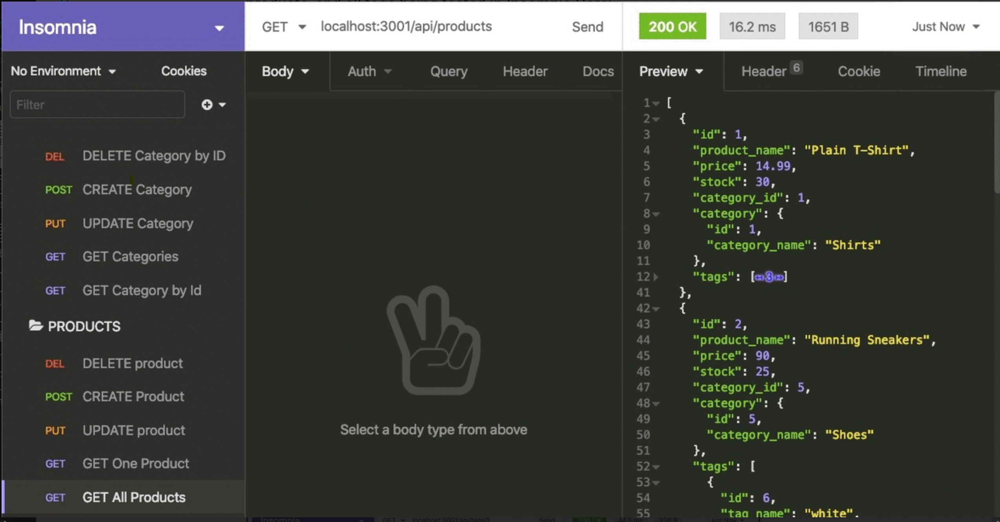

# drop-hop-shop

# Description

The Drop-Hop-Shop is the backend functionality for an e-commerce site. It's a working Express.js API that uses Sequelize to interact with a MySQL database.

# Links

[My github profile](https://github.com/AbdalehHersi)

[Drop-Hop-Shop](https://github.com/AbdalehHersi/Drop-Hop-Shop)

# Installation

Before you can use the program, you must have [Node.js](https://nodejs.org/en/download/), [Inquirer](https://www.npmjs.com/package/inquirer), [console.table](https://www.npmjs.com/package/console.table), [mysql2](https://www.npmjs.com/package/mysql2) package installed. You can download [Node.js](https://nodejs.org/en/download/) from the Node download web page or clicking on [this link](https://radixweb.com/blog/installing-npm-and-nodejs-on-windows-and-mac) for a more in-depth guide. 

Clone the repository code to a location of your choice using the command-line interface of your choice. Once you have done that, use `npm i` or `npm install` command-line interface on the same root level as the `package.json`. After that you should be good to go.

# Usage

You need to rename the `.env` file and modify it to enter your username and password. After you need to start MySQL and create the database. Seed the database by running `npm run seed` into the terminal.

To run the program all you need to do is enter `node server.js`. 



For a more in depth guide you can view this walkthrough.

[Video](https://drive.google.com/file/d/1-HwGVBPF2c6YQYw3joTF-ZzLxkOiMIyR/view)

[Backup Video](https://youtu.be/zd7YQ-D1SDs)

# Challenge Acceptance Criteria
```
GIVEN a functional Express.js API
WHEN I add my database name, MySQL username, and MySQL password to an environment variable file
THEN I am able to connect to a database using Sequelize
WHEN I enter schema and seed commands
THEN a development database is created and is seeded with test data
WHEN I enter the command to invoke the application
THEN my server is started and the Sequelize models are synced to the MySQL database
WHEN I open API GET routes in Insomnia Core for categories, products, or tags
THEN the data for each of these routes is displayed in a formatted JSON
WHEN I test API POST, PUT, and DELETE routes in Insomnia Core
THEN I am able to successfully create, update, and delete data in my database
```